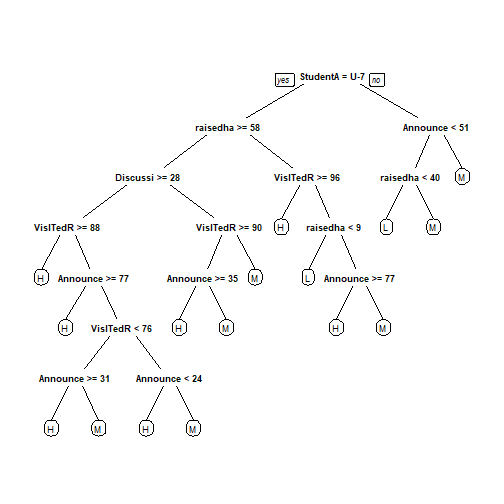

# 4. Decision trees
## Chuan bị data

```r
library(tidyverse)
```

```
## Error in library(tidyverse): there is no package called 'tidyverse'
```

```r
library(rpart)
library(rpart.plot)
setwd("D:/2. School/CuoiKi R 2")
```

```
## Error in setwd("D:/2. School/CuoiKi R 2"): cannot change working directory
```

```r
df <- read.csv(file='./data/xAPI-Edu-Data.csv')
df <- select(df, -PlaceofBirth, -StageID, -SectionID, -Semester, -Relation, -ParentAnsweringSurvey,-GradeID,-Topic,-gender,  -ParentschoolSatisfaction,-NationalITy)
library(caTools)
set.seed(101) 
sample <- sample.split(df$Class, SplitRatio = 0.70) # SplitRatio = percent of sample==TRUE
# Training Data
train = subset(df, sample == TRUE)
# Testing Data
test = subset(df, sample == FALSE)
```
## Decision trees

```r
tree.model <- rpart(Class ~ ., data = train, method = "class", minbucket = 1)
prp(tree.model) 
```




```r
tree.predict <- predict(tree.model, test, type = "class")
table(test$Class, tree.predict)
```

```
##    tree.predict
##      H  L  M
##   H 30  0 13
##   L  0 28 10
##   M 12 10 41
```
Decision trees using caret package


